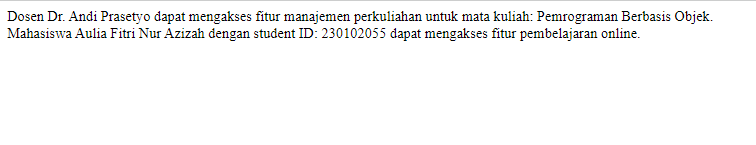

# Pweb2-tugas1
# JOB SHEET 1
# Instruksi Kerja 1
## Pembuatan Class dan Objek

Proyek ini mendemonstrasikan penggunaan kelas sederhana dalam PHP untuk mengelola data mahasiswa (`Mahasiswa`). Kelas `Mahasiswa` memiliki tiga atribut: `nama`, `nim`, dan `jurusan`. Kelas ini juga memiliki metode `tampilkanData()` untuk menampilkan detail mahasiswa.

### Langkah Pembuatan Class dan Objek Mahasiswa
- Membuat class Mahasiswa yang memiliki atribut nama, nim, dan jurusan.
- Membuat metode tampilkanData() dalam class Mahasiswa.
-  Melakukan Instansiasi objek dari class Mahasiswa dan tampilkan data mahasiswa tersebut.


 **Atribut Kelas**:
  - `nama`: Menyimpan nama mahasiswa.
  - `nim`: Menyimpan nomor induk mahasiswa (NIM).
  - `jurusan`: Menyimpan jurusan atau program studi mahasiswa.

**Metode**:
- `tampilkanData()`: Menampilkan nama, NIM, dan jurusan mahasiswa dalam format yang mudah dibaca.

## Penjelasan Kode

Berikut ini adalah penjelasan singkat mengenai kode:

Definisi Kelas

Kelas `Mahasiswa` didefinisikan dengan tiga atribut publik dan satu metode untuk menampilkan data mahasiswa:

```php
class Mahasiswa {
    public $nama;
    public $nim;
    public $jurusan;

    // Metode untuk menampilkan data mahasiswa
    public function tampilkanData() {
        return "Nama: $this->nama, NIM: $this->nim, Jurusan: $this->jurusan";
    }
}
```
Metode yang digunakan untuk menampilkan data dari Mahasiswa
```php
// Metode untuk menampilkan data mahasiswa
    public function tampilkanData() {
        return "Nama: $this->nama, NIM: $this->nim, Jurusan: $this->jurusan";
    }
}
```
Instansiasi dan tampil data dari objek Mahasiswa
```php
// Instansiasi objek Mahasiswa
$mahasiswa1 = new Mahasiswa();
$mahasiswa1->nama = "Aulia Fitri Nur Azizah";
$mahasiswa1->nim = "230102055";
$mahasiswa1->jurusan = "Teknik Informatika";

// Menampilkan data mahasiswa
echo $mahasiswa1->tampilkanData();
?>
```
Coding secara keseluruhan untuk pembuatan class dan objek mahasiswa
```php
<?php
class Mahasiswa {
    public $nama;
    public $nim;
    public $jurusan;

    // Metode untuk menampilkan data mahasiswa
    public function tampilkanData() {
        return "Nama: $this->nama, NIM: $this->nim, Jurusan: $this->jurusan";
    }
}

// Instansiasi objek tanpa constructor
$mahasiswa1 = new Mahasiswa();
$mahasiswa1->nama = "Aulia Fitri Nur Azizah";
$mahasiswa1->nim = "230102055";
$mahasiswa1->jurusan = "Teknik Informatika";

// Menampilkan data mahasiswa
echo $mahasiswa1->tampilkanData();
?>
```
Output Program


# Instruksi Kerja 2
## Implementasi Constructor

- **Menampilkan data mahasiswa seperti nama, NIM, dan jurusan.**

- **Penggunaan konsep OOP dengan constructor untuk menginisialisasi objek.**


## Struktur Kelas
**Kelas: Mahasiswa**

-**Atribut:**

-`nama`: Menyimpan nama mahasiswa.

-`nim`: Menyimpan NIM mahasiswa.

-`jurusan`: Menyimpan jurusan mahasiswa.

**Metode:**

-**__construct($nama, $nim, $jurusan): Constructor untuk menginisialisasi atribut nama, NIM, dan jurusan.**

-**tampilkanData(): Mengembalikan string yang berisi informasi nama, NIM, dan jurusan mahasiswa.**

## Cara Penggunaan
Instansiasi objek Mahasiswa dengan memberikan nilai `nama`, `NIM`, dan `jurusan`.
Panggil `metode tampilkanData()` untuk menampilkan `data mahasiswa`.
Contoh Kode:

Definisi class mahasiswa
```php
<?php
class Mahasiswa {
    public $nama;
    public $nim;
    public $jurusan;
```
Pembuatan constructor untuk menginisialisasi atribut
```php
    // Constructor untuk menginisialisasi atribut
    public function __construct($nama, $nim, $jurusan) {
        $this->nama = $nama;
        $this->nim = $nim;
        $this->jurusan = $jurusan;
    }
```
Metode untuk menampilkan data mahasiswa
```php
    public function tampilkanData() {
        return "Nama: $this->nama, NIM: $this->nim, Jurusan: $this->jurusan";
    }
}
```
Pembuatan objek mahasiswa1
```php
// Instansiasi objek dari class Mahasiswa dengan constructor
$mahasiswa1 = new Mahasiswa("Aulia Fitri Nur Azizah", "230102055", "Teknik Informatika");
echo $mahasiswa1->tampilkanData();
?>
```
Berikut ini adalah coding keseluruhan untuk membuat oop dengan penerapan implementasi  construct 

```php
<?php
class Mahasiswa {
    public $nama;
    public $nim;
    public $jurusan;

    // Constructor untuk menginisialisasi atribut
    public function __construct($nama, $nim, $jurusan) {
        $this->nama = $nama;
        $this->nim = $nim;
        $this->jurusan = $jurusan;
    }

    public function tampilkanData() {
        return "Nama: $this->nama, NIM: $this->nim, Jurusan: $this->jurusan";
    }
}

// Instansiasi objek dari class Mahasiswa dengan constructor
$mahasiswa1 = new Mahasiswa("Aulia Fitri Nur Azizah", "230102055", "Teknik Informatika");
echo $mahasiswa1->tampilkanData();
?>
```
Output Program


# Instruksi Kerja 3
**Membuat Metode Tambahan**

- Membuat metode updateJurusan() dalam kelas Mahasiswa yang memungkinkan 
perubahan jurusan.

- Menggunakan metode ini untuk mengubah jurusan dari objek yang sudah dibuat.

Proyek ini merupakan implementasi sederhana dari konsep Pemrograman Berorientasi Objek (OOP) dalam PHP. Kelas Mahasiswa dibuat untuk merepresentasikan data mahasiswa dengan atribut seperti nama, NIM, dan jurusan. Proyek ini menunjukkan bagaimana objek dapat diinstansiasi, serta bagaimana metode dalam kelas digunakan untuk menampilkan dan memperbarui data.

Dengan menggunakan  metode tambahan, class tersebut dapat menampilkan data mahasiswa seperti nama, NIM, dan jurusan dan memungkinkan untuk pembarusan data jurusan mahasiswa

- Metode:
__construct($nama, $nim, $jurusan): Konstruktor yang digunakan untuk menginisialisasi objek mahasiswa dengan atribut nama, NIM, dan jurusan.**

- TampilkanData(): Mengembalikan string yang berisi informasi mahasiswa (nama, NIM, dan jurusan).
updateJurusan($jurusanBaru): Mengubah nilai jurusan mahasiswa.

### Cara Menggunakan
- Instansiasi objek dari kelas Mahasiswa dengan memberikan parameter untuk nama, NIM, dan jurusan.

- Gunakan metode tampilkanData() untuk menampilkan data mahasiswa.
- Untuk mengubah jurusan, gunakan metode updateJurusan() dan masukkan jurusan baru.
Panggil kembali metode tampilkanData() untuk menampilkan data yang diperbarui.

Definisi class mahasiswa
```php
<?php
class Mahasiswa {
    public $nama;
    public $nim;
    public $jurusan;
```
Constructor untuk atribut nama, nim, jurusan 
```php
    public function __construct($nama, $nim, $jurusan) {
        $this->nama = $nama;
        $this->nim = $nim;
        $this->jurusan = $jurusan;
    }
```
Function untuk metode tampil data
```php
    // Metode untuk menampilkan data mahasiswa
    public function tampilkanData() {
        return "Nama: $this->nama, NIM: $this->nim, Jurusan: $this->jurusan";
    }
```
Function membuat metode tambahan yang digunakan untuk update data 
```php
    // Metode untuk mengubah jurusan
    public function updateJurusan($jurusanBaru) {
        $this->jurusan = $jurusanBaru;
    }
}
```
Proses instansiasi objek
```php
// Instansiasi objek dan memperbarui jurusan
$mahasiswa1 = new Mahasiswa("Aulia Fitri Nur Azizah", "230102055", "Teknik Informatika");
echo $mahasiswa1->tampilkanData() . "<br>";

// Mengubah jurusan
$mahasiswa1->updateJurusan("Sistem Informasi");
echo $mahasiswa1->tampilkanData();
?>
```

Berikut ini adalah coding secara keseluruhan untuk membuat metode tambahan dalam oop di class mahasiswa
```php
<?php
class Mahasiswa {
    public $nama;
    public $nim;
    public $jurusan;

    public function __construct($nama, $nim, $jurusan) {
        $this->nama = $nama;
        $this->nim = $nim;
        $this->jurusan = $jurusan;
    }

    // Metode untuk menampilkan data mahasiswa
    public function tampilkanData() {
        return "Nama: $this->nama, NIM: $this->nim, Jurusan: $this->jurusan";
    }

    // Metode untuk mengubah jurusan
    public function updateJurusan($jurusanBaru) {
        $this->jurusan = $jurusanBaru;
    }
}

// Instansiasi objek dan memperbarui jurusan
$mahasiswa1 = new Mahasiswa("Aulia Fitri Nur Azizah", "230102055", "Teknik Informatika");
echo $mahasiswa1->tampilkanData() . "<br>";

// Mengubah jurusan
$mahasiswa1->updateJurusan("Sistem Informasi");
echo $mahasiswa1->tampilkanData();
?>
```
Output Program

# Instruksi 4
### Penggunaan Atribut dan Metode
Instruksi ini adalah implementasi konsep Pemrograman Berorientasi Objek (OOP) dalam PHP yang mencakup pembuatan kelas Mahasiswa. Kelas ini menyimpan data mahasiswa berupa nama, NIM, dan jurusan. Selain itu, kelas ini dilengkapi dengan metode untuk menampilkan data mahasiswa, mengubah jurusan, dan mengubah NIM melalui metode setter.

Tujuan dari penerapan instruksi 4 adalah :
- Menampilkan Data Mahasiswa: Menampilkan informasi mahasiswa yang mencakup nama, NIM, dan jurusan.
- Update Jurusan: Mengubah jurusan mahasiswa dengan jurusan baru.
Set NIM: Mengubah NIM mahasiswa melalui metode setter.

**Metode:**
- __construct($nama, $nim, $jurusan): Konstruktor untuk menginisialisasi objek mahasiswa dengan atribut nama, NIM, dan jurusan.
- tampilkanData(): Mengembalikan string yang berisi informasi mahasiswa (nama, NIM, dan jurusan).
- updateJurusan($jurusanBaru): Mengubah jurusan mahasiswa.
- setNim($nimBaru): Metode setter untuk memperbarui NIM mahasiswa.

Cara Menggunakan

- Buat objek dari kelas Mahasiswa dengan memberikan parameter nama, NIM, dan jurusan saat instansiasi.
- Gunakan metode tampilkanData() untuk menampilkan data mahasiswa.
Untuk mengubah jurusan, gunakan metode updateJurusan() dengan jurusan baru.
- Untuk mengubah NIM, gunakan metode setNim() dengan NIM baru.
Tampilkan data terbaru menggunakan tampilkanData().

Definisi Calass Mahasiswa
```php
<?php
class Mahasiswa {
    public $nama;
    public $nim;
    public $jurusan;
```
Constructor untuk atribut nama, nim, dan jurusan
```php
    public function __construct($nama, $nim, $jurusan) {
        $this->nama = $nama;
        $this->nim = $nim;
        $this->jurusan = $jurusan;
    }
```
Metode untuk menampilkan data mahasiswa
```php
    // Metode untuk menampilkan data mahasiswa
    public function tampilkanData() {
        return "Nama: $this->nama, NIM: $this->nim, Jurusan: $this->jurusan";
    }
```
Metode ubah jurusan
```php 
    // Metode untuk mengubah jurusan
    public function updateJurusan($jurusanBaru) {
        $this->jurusan = $jurusanBaru;
    }
```
Metode ubah NIM
```php
    // Metode setter untuk mengubah NIM
    public function setNim($nimBaru) {
        $this->nim = $nimBaru;
    }
}
```
Proses Instansiasi Objek
```php
// Instansiasi objek, memperbarui jurusan dan NIM
$mahasiswa1 = new Mahasiswa("Aulia Fitri Nur Azizah", "230102055", "Teknik Informatika");
echo $mahasiswa1->tampilkanData() . "<br>";

// Mengubah jurusan
$mahasiswa1->updateJurusan("Sistem Informasi");
echo $mahasiswa1->tampilkanData() . "<br>";

// Mengubah NIM
$mahasiswa1->setNim("230102066");
echo $mahasiswa1->tampilkanData();
?>
```
Berikut ini adalah coding secara keseluruhan untuk penerapan konsep oop dengan penerapan atribut dan metode
```php
<?php
class Mahasiswa {
    public $nama;
    public $nim;
    public $jurusan;

    public function __construct($nama, $nim, $jurusan) {
        $this->nama = $nama;
        $this->nim = $nim;
        $this->jurusan = $jurusan;
    }

    // Metode untuk menampilkan data mahasiswa
    public function tampilkanData() {
        return "Nama: $this->nama, NIM: $this->nim, Jurusan: $this->jurusan";
    }

    // Metode untuk mengubah jurusan
    public function updateJurusan($jurusanBaru) {
        $this->jurusan = $jurusanBaru;
    }

    // Metode setter untuk mengubah NIM
    public function setNim($nimBaru) {
        $this->nim = $nimBaru;
    }
}

// Instansiasi objek, memperbarui jurusan dan NIM
$mahasiswa1 = new Mahasiswa("Aulia Fitri Nur Azizah", "230102055", "Teknik Informatika");
echo $mahasiswa1->tampilkanData() . "<br>";

// Mengubah jurusan
$mahasiswa1->updateJurusan("Sistem Informasi");
echo $mahasiswa1->tampilkanData() . "<br>";

// Mengubah NIM
$mahasiswa1->setNim("230102066");
echo $mahasiswa1->tampilkanData();
?>
```
Output Program

# Tugas Modul 1
Dalam tugas ini terdapat implementasi dasar dari konsep Pemrograman Berorientasi Objek (OOP) dalam PHP yang mencakup pembuatan kelas Dosen. Kelas ini menyimpan data dosen, seperti nama, NIP, dan mata kuliah yang diampu. Proyek ini menunjukkan bagaimana cara menginisialisasi objek dosen dan menampilkan datanya menggunakan metode yang ada di dalam kelas.

Kelas Dosen memiliki beberapa atribut didalamnya seperti:

-`nama` Menyimpan nama dosen.

-`nip` Menyimpan Nomor Induk Pegawai (NIP).
mataKuliah 

-`mata kuliah` Menyimpan mata kuliah yang diajarkan.
Konstruktor untuk menginisialisasi objek Dosen dengan data dosen.
Metode tampilkanDosen() untuk menampilkan informasi dosen dalam format yang mudah dibaca.

Dalam tugas tersebut, terdapat constructor yang digunakan untuk menginisialisasi objek dosen dengan data dosen. Untuk menampilkan data dosen bisa menggunakan function tampilkanDosen().

Definisi class dosen beserta atribut
```php
<?php
// Definisi kelas Dosen
class Dosen {
    // Properti kelas untuk menyimpan nama, NIP, dan mata kuliah
    public $nama;
    public $nip;
    public $mataKuliah;
```
Constructor untuk atribut nama, nip, mataKuliah
```php
    // Konstruktor untuk menginisialisasi objek dosen dengan nama, NIP, dan mata kuliah
    public function __construct($nama, $nip, $mataKuliah) {
        // Menetapkan nilai parameter ke properti kelas
        $this->nama = $nama;
        $this->nip = $nip;
        $this->mataKuliah = $mataKuliah;
    }
   ``` 
   Function untuk menampilkan data dosen
   ```php
    // Metode untuk menampilkan data dosen
    public function tampilkanDosen() {
        // Mengembalikan string yang berisi informasi dosen
        return "Nama: $this->nama, NIP: $this->nip, Mata Kuliah: $this->mataKuliah";
    }
}
```
Proses pembantukan objek
```php
// Instansiasi objek dari kelas Dosen dengan memberikan nilai nama, NIP, dan mata kuliah
$dosen1 = new Dosen("Aulia Fitri Nur Azizah", "230102055", "Kewarganegaraan");

// Menampilkan informasi dosen dengan memanggil metode tampilkanDosen
echo $dosen1->tampilkanDosen();
?>
```
Berikut ini adalah coding secara keseluruhan untuk tugas jobsheet 1
```php
<?php
// Definisi kelas Dosen
class Dosen {
    // Properti kelas untuk menyimpan nama, NIP, dan mata kuliah
    public $nama;
    public $nip;
    public $mataKuliah;

    // Konstruktor untuk menginisialisasi objek dosen dengan nama, NIP, dan mata kuliah
    public function __construct($nama, $nip, $mataKuliah) {
        // Menetapkan nilai parameter ke properti kelas
        $this->nama = $nama;
        $this->nip = $nip;
        $this->mataKuliah = $mataKuliah;
    }
    
    // Metode untuk menampilkan data dosen
    public function tampilkanDosen() {
        // Mengembalikan string yang berisi informasi dosen
        return "Nama: $this->nama, NIP: $this->nip, Mata Kuliah: $this->mataKuliah";
    }
}

// Instansiasi objek dari kelas Dosen dengan memberikan nilai nama, NIP, dan mata kuliah
$dosen1 = new Dosen("Aulia Fitri Nur Azizah", "230102055", "Kewarganegaraan");

// Menampilkan informasi dosen dengan memanggil metode tampilkanDosen
echo $dosen1->tampilkanDosen();
?>
```
Output Program

# JOBSHEET 2
# Instruksi Kerja 1
### Membuat Class dan Objek
Instruksi ini menggamabarkan contoh sederhana implementasi Object-Oriented Programming (OOP) dalam PHP yang menampilkan data mahasiswa seperti nama, NIM, dan jurusan. Kode ini mendemonstrasikan penggunaan atribut dan metode dalam kelas Mahasiswa.

Kelas Mahasiswa memiliki atribut:
- `nama` untuk Menyimpan nama mahasiswa.
- `nim` untuk Menyimpan Nomor Induk Mahasiswa (NIM).
- `jurusan `Menyimpan jurusan mahasiswa.
Metode tampilkanData() untuk menampilkan informasi mahasiswa dalam format yang mudah dibaca.


Deklarasi class mahasiswa beserta atributnya
```php
<?php
// Kelas Mahasiswa
class Mahasiswa {
    // Atribut
    public $nama;
    public $nim;
    
    public $jurusan;
```
Metode untuk tampil data
```php
    // Metode untuk menampilkan data mahasiswa
    public function tampilkanData() {
        return "Nama: $this->nama, NIM: $this->nim, Jurusan: $this->jurusan";
    }
}
```
Proses pembuatan objek
```php
// Instansiasi objek dari kelas Mahasiswa
$mahasiswa1 = new Mahasiswa();
$mahasiswa1->nama = "Aulia Fitri Nur Azizah"; // Mengatur nama
$mahasiswa1->nim = "230102055";              // Mengatur NIM
$mahasiswa1->jurusan = "Teknik Informatika"; // Mengatur jurusan

// Menampilkan data mahasiswa
echo $mahasiswa1->tampilkanData();
?>
```
Output Program

# Instruksi Kerja 2
### Encapsulation
Pada instruksi ini terdapat contoh implementasi Object-Oriented Programming (OOP) dengan menerapkan konsep Encapsulation di PHP. Kelas Mahasiswa memiliki atribut private, yang hanya dapat diakses dan diubah melalui metode getter dan setter. Instruksi ini memberi perintah untuk mendemonstrasikan bagaimana mengatur dan mengambil nilai atribut menggunakan metode tersebut.


Encapsulation adalah atribut dalam kelas Mahasiswa bersifat private dan hanya bisa diakses melalui metode getter dan setter.

Atribut kelas mahasiswa diantaranya adalah:

-`nama` - Menyimpan nama mahasiswa.

-`nim` - Menyimpan Nomor Induk Mahasiswa (NIM).

-`jurusan` - Menyimpan jurusan mahasiswa.

Penerapan metode yang digunakan adalah:  

- Metode setter untuk mengatur nilai atribut.

- Metode getter untuk mengambil nilai atribut.

- Metode tampilkanData() untuk menampilkan informasi mahasiswa.
Deklarasi class dan atribut mahasiswa
```php
<?php
class Mahasiswa {
    // Atribut private
    private $nama;
    private $nim;
    private $jurusan;
```
Metode setter dan getter untuk nama
```php
    // Metode setter untuk nama
    public function setNama($nama) {
        $this->nama = $nama;
    }

    // Metode getter untuk nama
    public function getNama() {
        return $this->nama;
    }
```
Metode setter dan getter untuk nim
```php 
    // Metode setter untuk NIM
    public function setNim($nim) {
        $this->nim = $nim;
    }

    // Metode getter untuk NIM
    public function getNim() {
        return $this->nim;
    }
```
Metode setter dan getter untuk jurusan
```php
    // Metode setter untuk jurusan
    public function setJurusan($jurusan) {
        $this->jurusan = $jurusan;
    }

    // Metode getter untuk jurusan
    public function getJurusan() {
        return $this->jurusan;
    }
```
Metode tampil data mahasiswa
```php
    // Metode untuk menampilkan data mahasiswa
    public function tampilkanData() {
        return "Nama: " . $this->getNama() . ", NIM: " . $this->getNim() . ", Jurusan: " . $this->getJurusan();
    }
}
```
Proses pembuatan objek
```php
// Instansiasi objek dari kelas Mahasiswa
$mahasiswa1 = new Mahasiswa();

// Menggunakan setter untuk mengatur nilai atribut
$mahasiswa1->setNama("Aulia Fitri Nur Azizah");
$mahasiswa1->setNim("230102055");
$mahasiswa1->setJurusan("Teknik Informatika");

// Menampilkan data mahasiswa menggunakan metode tampilkanData
echo $mahasiswa1->tampilkanData();
?>
```
Berikut ini adalah coding keseluruhan untuk membuat mahasiswa dan class
```php
<?php
class Mahasiswa {
    // Atribut private
    private $nama;
    private $nim;
    private $jurusan;

    // Metode setter untuk nama
    public function setNama($nama) {
        $this->nama = $nama;
    }

    // Metode getter untuk nama
    public function getNama() {
        return $this->nama;
    }

    // Metode setter untuk NIM
    public function setNim($nim) {
        $this->nim = $nim;
    }

    // Metode getter untuk NIM
    public function getNim() {
        return $this->nim;
    }

    // Metode setter untuk jurusan
    public function setJurusan($jurusan) {
        $this->jurusan = $jurusan;
    }

    // Metode getter untuk jurusan
    public function getJurusan() {
        return $this->jurusan;
    }

    // Metode untuk menampilkan data mahasiswa
    public function tampilkanData() {
        return "Nama: " . $this->getNama() . ", NIM: " . $this->getNim() . ", Jurusan: " . $this->getJurusan();
    }
}

// Instansiasi objek dari kelas Mahasiswa
$mahasiswa1 = new Mahasiswa();

// Menggunakan setter untuk mengatur nilai atribut
$mahasiswa1->setNama("Aulia Fitri Nur Azizah");
$mahasiswa1->setNim("230102055");
$mahasiswa1->setJurusan("Teknik Informatika");

// Menampilkan data mahasiswa menggunakan metode tampilkanData
echo $mahasiswa1->tampilkanData();
?>
```
Output Program 

# Instruksi Kerja 3
### Inheritance
Dalam instruksi ini terdapat contoh implementasi Object-Oriented Programming (OOP) dengan menggunakan konsep inheritance (pewarisan) dalam PHP. Di dalam proyek ini, terdapat dua kelas utama, yaitu:

-`Pengguna` sebagai parent class dengan atribut nama.

-`Dosen` sebagai child class yang mewarisi kelas Pengguna, dan menambahkan atribut mata kuliah yang diajarkan.

 Intruksi ini menunjukkan bagaimana sebuah kelas dapat mewarisi properti dan metode dari kelas lain, serta bagaimana menggunakan metode getter untuk mengakses data dari parent class.

 Fitur yang terdapat pada instruksi ini diantaranya adalah:
 - Inheritance: Kelas Dosen mewarisi atribut dan metode dari kelas Pengguna.
- Kelas Pengguna dengan atribut protected:
nama - Menyimpan nama pengguna (dalam konteks ini, nama dosen).
- Kelas Dosen dengan atribut private:
mataKuliah untuk menyimpan mata kuliah yang diajarkan oleh dosen.
Metode getter untuk mengambil nilai atribut pada kedua kelas.
- Metode tampilkanDataDosen() untuk menampilkan informasi dosen yang lengkap.

Pembuatan class pengguna beserta construction dan metode function getNama
```php
<?php
// Parent class Pengguna
class Pengguna {
    protected $nama;

    public function __construct($nama) {
        $this->nama = $nama;
    }

    public function getNama() {
        return $this->nama;
    }
}
```
Pembuatan class dosen yang mewarisi sifat atau atribut dari class pengguna
```php

// Child class Dosen yang mewarisi class Pengguna
class Dosen extends Pengguna {
    private $mataKuliah;

    public function __construct($nama, $mataKuliah) {
        // Memanggil konstruktor parent class
        parent::__construct($nama);
        $this->mataKuliah = $mataKuliah;
    }

    public function getMataKuliah() {
        return $this->mataKuliah;
    }

    public function tampilkanDataDosen() {
        return "Nama Dosen: " . $this->getNama() . ", Mata Kuliah: " . $this->getMataKuliah();
    }
}
```
Pembuatan objek class Dosen
```php
// Instansiasi objek dari class Dosen
$dosen1 = new Dosen("Dr. Andi Prasetyo", "Pemrograman Berbasis Objek");

// Tampilkan data dosen
echo $dosen1->tampilkanDataDosen();
?>
```
Berikut ini adalah coding secara keseluruhan untuk instuksi 3
```php
<?php
// Parent class Pengguna
class Pengguna {
    protected $nama;

    public function __construct($nama) {
        $this->nama = $nama;
    }

    public function getNama() {
        return $this->nama;
    }
}

// Child class Dosen yang mewarisi class Pengguna
class Dosen extends Pengguna {
    private $mataKuliah;

    public function __construct($nama, $mataKuliah) {
        // Memanggil konstruktor parent class
        parent::__construct($nama);
        $this->mataKuliah = $mataKuliah;
    }

    public function getMataKuliah() {
        return $this->mataKuliah;
    }

    public function tampilkanDataDosen() {
        return "Nama Dosen: " . $this->getNama() . ", Mata Kuliah: " . $this->getMataKuliah();
    }
}

// Instansiasi objek dari class Dosen
$dosen1 = new Dosen("Dr. Andi Prasetyo", "Pemrograman Berbasis Objek");

// Tampilkan data dosen
echo $dosen1->tampilkanDataDosen();
?>

```

Output Program

# Instruksi Kerja 4
### Polymorphism
Polymorphism adalah kemampuan suatu objek untuk menampilkan perilaku yang berbeda

Dalam instruksi ini terdapat contoh penerapan Object-Oriented Programming (OOP) dengan menggunakan konsep inheritance (pewarisan) dan polymorphism dalam PHP. Di proyek ini, terdapat tiga kelas utama, yaitu:

-`Pengguna` (parent class) - Menyimpan atribut nama dan metode akses fitur umum.

-`Dosen` (child class) - Mewarisi kelas Pengguna dan menambahkan atribut mata kuliah, serta melakukan override metode aksesFitur.

-`Mahasiswa` (child class) - Mewarisi kelas Pengguna dan menambahkan atribut student ID, serta melakukan override metode aksesFitur.

Dalam implementasi ini menunjukkan bagaimana polymorphism diterapkan dengan meng-override metode pada child class yang berbeda, meskipun memiliki struktur yang sama.

Pembuatan class Pengguna dengan menggunakan constuctor dan menggunakan function getNama dan aksesFitur
```php
<?php
// Parent class Pengguna
class Pengguna {
    private $nama;

    public function __construct($nama) {
        $this->nama = $nama;
    }

    // Getter untuk nama karena nama sekarang private
    public function getNama() {
        return $this->nama;
    }

    // Metode aksesFitur akan diimplementasikan ulang oleh child class
    public function aksesFitur() {
        return $this->getNama();
    }
}
```
Penurunan sifat dari class pengguna ke class dosen
```php

// Child class Dosen
class Dosen extends Pengguna {
    private $mataKuliah;

    public function __construct($nama, $mataKuliah) {
        parent::__construct($nama); // Memanggil konstruktor parent
        $this->mataKuliah = $mataKuliah;
    }

    // Override metode aksesFitur
    public function aksesFitur() {
        return "Dosen " . $this->getNama() . " dapat mengakses fitur manajemen perkuliahan untuk mata kuliah: " . $this->mataKuliah . ".";
    }
}
```
Penurunan sifat dari class pengguna ke class mahasiswa
```php
// Child class Mahasiswa
class Mahasiswa extends Pengguna {
    private $studentID;

    public function __construct($nama, $studentID) {
        parent::__construct($nama); // Memanggil konstruktor parent
        $this->studentID = $studentID;
    }

    // Override metode aksesFitur
    public function aksesFitur() {
        return "Mahasiswa " . $this->getNama() . " dengan student ID: " . $this->studentID . " dapat mengakses fitur pembelajaran online.";
    }
}
```
Proses Pembuatan objek dosen dan mahasiswa
```php

// Instansiasi objek dari class Dosen dan Mahasiswa
$dosen1 = new Dosen("Dr. Andi Prasetyo", "Pemrograman Berbasis Objek");
$mahasiswa1 = new Mahasiswa("Aulia Fitri Nur Azizah", "230102055");

// Memanggil metode aksesFitur() dari objek Dosen dan Mahasiswa
echo $dosen1->aksesFitur() . "<br>"; // Menggunakan <br> untuk baris baru di output HTML
echo $mahasiswa1->aksesFitur();
?>
```
Berikut ini adalah coding keseluruhan untuk polymorphism instuksi 4
```php
<?php
// Parent class Pengguna
class Pengguna {
    private $nama;

    public function __construct($nama) {
        $this->nama = $nama;
    }

    // Getter untuk nama karena nama sekarang private
    public function getNama() {
        return $this->nama;
    }

    // Metode aksesFitur akan diimplementasikan ulang oleh child class
    public function aksesFitur() {
        return $this->getNama();
    }
}

// Child class Dosen
class Dosen extends Pengguna {
    private $mataKuliah;

    public function __construct($nama, $mataKuliah) {
        parent::__construct($nama); // Memanggil konstruktor parent
        $this->mataKuliah = $mataKuliah;
    }

    // Override metode aksesFitur
    public function aksesFitur() {
        return "Dosen " . $this->getNama() . " dapat mengakses fitur manajemen perkuliahan untuk mata kuliah: " . $this->mataKuliah . ".";
    }
}

// Child class Mahasiswa
class Mahasiswa extends Pengguna {
    private $studentID;

    public function __construct($nama, $studentID) {
        parent::__construct($nama); // Memanggil konstruktor parent
        $this->studentID = $studentID;
    }

    // Override metode aksesFitur
    public function aksesFitur() {
        return "Mahasiswa " . $this->getNama() . " dengan student ID: " . $this->studentID . " dapat mengakses fitur pembelajaran online.";
    }
}

// Instansiasi objek dari class Dosen dan Mahasiswa
$dosen1 = new Dosen("Dr. Andi Prasetyo", "Pemrograman Berbasis Objek");
$mahasiswa1 = new Mahasiswa("Aulia Fitri Nur Azizah", "230102055");

// Memanggil metode aksesFitur() dari objek Dosen dan Mahasiswa
echo $dosen1->aksesFitur() . "<br>"; // Menggunakan <br> untuk baris baru di output HTML
echo $mahasiswa1->aksesFitur();
?>
```
Output program

# Instruksi 5
### Abstraction
Instruksi ini menampilkan implementasi Object-Oriented Programming (OOP) dalam PHP menggunakan konsep abstract class dan inheritance. Terdapat satu abstract class utama (Pengguna) yang diimplementasikan oleh dua class turunan (Mahasiswa dan Dosen).

Abstract class Pengguna mendefinisikan kerangka dasar dengan metode abstrak yang harus diimplementasikan oleh class turunan.
Mahasiswa dan Dosen adalah class turunan yang mengimplementasikan metode abstrak aksesFitur() untuk memberikan fitur spesifik berdasarkan peran pengguna.

Terdapat fitur yang digunakan dalam program ini, diantaranya adalah:
- Abstract Class: Class Pengguna adalah abstract class yang berisi metode abstrak aksesFitur() yang harus diimplementasikan oleh class turunan.
-   Inheritance: Kelas Mahasiswa dan Dosen mewarisi properti dan metode dari abstract class Pengguna.
-   Encapsulation: Atribut nama, studentID, dan mataKuliah dienkapsulasi dalam class dengan akses yang terbatas.

Pembuatan class pengguna dengan menggunakan constructor, metode abstrak, dan function getNama
```php
<?php
// Class abstrak Pengguna
abstract class Pengguna {
    protected $nama;

    public function __construct($nama) {
        $this->nama = $nama;
    }

    // Metode abstrak yang harus diimplementasikan oleh class turunan
    abstract public function aksesFitur();
    
    // Fungsi umum yang bisa digunakan oleh semua class turunan
    public function getNama() {
        return $this->nama;
    }
}
```
Pembuatan class mahasiswa dengan mengimplementasikan metode abstrak dan memiliki sifat turunan dari class pengguna
```php

// Class Mahasiswa yang mengimplementasikan metode abstrak
class Mahasiswa extends Pengguna {
    private $studentID;

    public function __construct($nama, $studentID) {
        parent::__construct($nama);
        $this->studentID = $studentID;
    }

    // Implementasi metode abstrak aksesFitur
    public function aksesFitur() {
        return "Mahasiswa " . $this->getNama() . " (ID: " . $this->studentID . ") dapat mengakses fitur pembelajaran online.";
    }
}
```
Pembuatan class dosen dengan metode abstrak dan mewarisi sifat class pengguna
```php

// Class Dosen yang mengimplementasikan metode abstrak
class Dosen extends Pengguna {
    private $mataKuliah;

    public function __construct($nama, $mataKuliah) {
        parent::__construct($nama);
        $this->mataKuliah = $mataKuliah;
    }

    // Implementasi metode abstrak aksesFitur
    public function aksesFitur() {
        return "Dosen " . $this->getNama() . " mengajar mata kuliah " . $this->mataKuliah . " dan dapat mengakses fitur manajemen perkuliahan.";
    }
}
```
PEmbuatan objek untuk class mahasiswa dan dosen
```php
// Instansiasi objek dari class Mahasiswa dan Dosen
$mahasiswa1 = new Mahasiswa("Aulia Fitri Nur Azizah", "230102055");
$dosen1 = new Dosen("Dr. Andi Prasetyo", "Pemrograman Web");

// Memanggil metode aksesFitur() dari objek Mahasiswa dan Dosen
echo $mahasiswa1->aksesFitur() . "<br>";
echo $dosen1->aksesFitur();
?>
```
Berikut ini dalah coding secara keseluruhan untuk implementasi jobsheet 5
```php
<?php
// Class abstrak Pengguna
abstract class Pengguna {
    protected $nama;

    public function __construct($nama) {
        $this->nama = $nama;
    }

    // Metode abstrak yang harus diimplementasikan oleh class turunan
    abstract public function aksesFitur();
    
    // Fungsi umum yang bisa digunakan oleh semua class turunan
    public function getNama() {
        return $this->nama;
    }
}

// Class Mahasiswa yang mengimplementasikan metode abstrak
class Mahasiswa extends Pengguna {
    private $studentID;

    public function __construct($nama, $studentID) {
        parent::__construct($nama);
        $this->studentID = $studentID;
    }

    // Implementasi metode abstrak aksesFitur
    public function aksesFitur() {
        return "Mahasiswa " . $this->getNama() . " (ID: " . $this->studentID . ") dapat mengakses fitur pembelajaran online.";
    }
}

// Class Dosen yang mengimplementasikan metode abstrak
class Dosen extends Pengguna {
    private $mataKuliah;

    public function __construct($nama, $mataKuliah) {
        parent::__construct($nama);
        $this->mataKuliah = $mataKuliah;
    }

    // Implementasi metode abstrak aksesFitur
    public function aksesFitur() {
        return "Dosen " . $this->getNama() . " mengajar mata kuliah " . $this->mataKuliah . " dan dapat mengakses fitur manajemen perkuliahan.";
    }
}

// Instansiasi objek dari class Mahasiswa dan Dosen
$mahasiswa1 = new Mahasiswa("Aulia Fitri Nur Azizah", "230102055");
$dosen1 = new Dosen("Dr. Andi Prasetyo", "Pemrograman Web");

// Memanggil metode aksesFitur() dari objek Mahasiswa dan Dosen
echo $mahasiswa1->aksesFitur() . "<br>";
echo $dosen1->aksesFitur();
?>
```
Output Program

# Jobsheet 3
# Instruksi 1
### Inheritance
Instruksi ini menampilkan implementasi Object-Oriented Programming (OOP) dalam PHP, menggunakan konsep inheritance (pewarisan) antara dua class: Person sebagai parent class dan Student sebagai child class. Tujuan dari proyek ini adalah untuk menunjukkan bagaimana pewarisan digunakan untuk membuat class yang lebih spesifik dari class yang lebih umum.

Person adalah class induk yang mewakili entitas umum (orang) dengan atribut nama.
Student adalah class turunan yang mewarisi atribut dan metode dari class Person, serta menambahkan atribut khusus studentID.

Pembuatan class Person dengan constructor untuk menginisialisasi nama dan untuk mendapatkan nama
```php
<?php
// Kelas Person
class Person {
    // Atribut
    protected $name;

    // Constructor untuk menginisialisasi nama
    public function __construct($name) {
        $this->name = $name;
    }

    // Metode untuk mendapatkan nama
    public function getName() {
        return $this->name;
    }
}
```
Pembuatan class Student yang mewarisi sifat atau atribut dari class Person dengan menggunakan constructor untuk menginisialisasi nama dan studentID beserta metode untuk mendapat studentID
```php

// Kelas Student yang mewarisi dari Person
class Student extends Person {
    // Atribut tambahan
    private $studentID;

    // Constructor untuk menginisialisasi nama dan studentID
    public function __construct($name, $studentID) {
        // Memanggil constructor kelas induk (Person)
        parent::__construct($name);
        $this->studentID = $studentID;
    }

    // Metode untuk mendapatkan studentID
    public function getStudentID() {
        return $this->studentID;
    }
}
```
Pembuatan objek untuk student
```php

// Contoh penggunaan
// Membuat objek dari kelas Student
$student1 = new Student("Aulia Fitri Nur Azizah", "230102055");

// Menampilkan nama dan studentID
echo "Nama: " . $student1->getName() . "<br>";
echo "Student ID: " . $student1->getStudentID();
?>
```
Berikut ini adalah coding secara keseluruhan untuk implementasi instruksi 1
```php
<?php
// Kelas Person
class Person {
    // Atribut
    protected $name;

    // Constructor untuk menginisialisasi nama
    public function __construct($name) {
        $this->name = $name;
    }

    // Metode untuk mendapatkan nama
    public function getName() {
        return $this->name;
    }
}

// Kelas Student yang mewarisi dari Person
class Student extends Person {
    // Atribut tambahan
    private $studentID;

    // Constructor untuk menginisialisasi nama dan studentID
    public function __construct($name, $studentID) {
        // Memanggil constructor kelas induk (Person)
        parent::__construct($name);
        $this->studentID = $studentID;
    }

    // Metode untuk mendapatkan studentID
    public function getStudentID() {
        return $this->studentID;
    }
}

// Contoh penggunaan
// Membuat objek dari kelas Student
$student1 = new Student("Aulia Fitri Nur Azizah", "230102055");

// Menampilkan nama dan studentID
echo "Nama: " . $student1->getName() . "<br>";
echo "Student ID: " . $student1->getStudentID();
?>
```
Output program


### Instruksi 2
### Polymorphism
Instruksi ini menampilkan implementasi Object-Oriented Programming (OOP) dalam PHP, yang menggunakan konsep inheritance (pewarisan) dan method overriding antara class Person dan dua class turunannya: Student dan Teacher.

- Person adalah class induk yang mewakili entitas umum (orang).
- Student dan Teacher adalah class turunan yang masing-masing mewakili entitas khusus mahasiswa dan dosen.
- Method Overriding digunakan untuk mengganti implementasi metode getName() di class turunan dengan perilaku yang berbeda.

Terdapat beberapa fitur yang dapat diimplementasikan dalam instruksi ini, diantaranya adalah:
-   Inheritance: Class Student dan Teacher mewarisi atribut dan metode dari class Person.
-   Method Overriding: Metode getName() di-override pada class Student dan Teacher untuk memberikan output yang berbeda berdasarkan peran mereka.
-   Encapsulation: Atribut name dienkapsulasi sebagai protected, dan atribut studentID serta teacherID disetel sebagai private untuk menjaga keamanan data.

Pembuatan class person dengan mengunakan constrtuctor untuk menginisialisasi nama dan penggunaan metode getName untuk mendapatkan nama
```php
<?php
// Kelas Person
class Person {
    protected $name;

    // Constructor untuk menginisialisasi nama
    public function __construct($name) {
        $this->name = $name;
    }

    // Metode untuk mendapatkan nama
    public function getName() {
        return "Nama: " . $this->name;
    }
}
```
Pembuatan class student yang mewarisi sifat dari class Person dengan menggunakan constructor untuk menginisialisasi nama dan studentID, serta pembuatan function getNama untuk melakukan override metode getName
```php

// Kelas Student yang mewarisi dari Person
class Student extends Person {
    private $studentID;

    // Constructor untuk menginisialisasi nama dan studentID
    public function __construct($name, $studentID) {
        parent::__construct($name); // Memanggil constructor dari kelas induk
        $this->studentID = $studentID;
    }

    // Override metode getName()
    public function getName() {
        return "Mahasiswa: " . $this->name . " (NIM: $this->studentID)";
    }
}
```
Pembuatan class Teacher yang mewarisi sifat dari class Person dengan menggunakan constructor untuk menginisialisasi nama dan teacaherID beserta metode getName untuk melakukan override pada function getName
```php

// Kelas Teacher yang mewarisi dari Person
class Teacher extends Person {
    private $teacherID;

    // Constructor untuk menginisialisasi nama dan teacherID
    public function __construct($name, $teacherID) {
        parent::__construct($name); // Memanggil constructor dari kelas induk
        $this->teacherID = $teacherID;
    }

    // Override metode getName()
    public function getName() {
        return "Dosen: " . $this->name . " (ID Dosen: $this->teacherID)";
    }
}
```
Pembuatan objek untuk class student dan teacher
```php
// Instansiasi objek dari kelas Student
$student = new Student("Aulia Fitri Nur Azizah", "230102055");
echo $student->getName() . "\n"; // Menampilkan nama mahasiswa

// Instansiasi objek dari kelas Teacher
$teacher = new Teacher("Dr. Budi Santoso", "T123");
echo $teacher->getName(); // Menampilkan nama dosen
?>
```
Berikut ini adalah coding secara keseluruhan untuk menerapkan perintah di instruksi 2
```php
<?php
// Kelas Person
class Person {
    protected $name;

    // Constructor untuk menginisialisasi nama
    public function __construct($name) {
        $this->name = $name;
    }

    // Metode untuk mendapatkan nama
    public function getName() {
        return "Nama: " . $this->name;
    }
}

// Kelas Student yang mewarisi dari Person
class Student extends Person {
    private $studentID;

    // Constructor untuk menginisialisasi nama dan studentID
    public function __construct($name, $studentID) {
        parent::__construct($name); // Memanggil constructor dari kelas induk
        $this->studentID = $studentID;
    }

    // Override metode getName()
    public function getName() {
        return "Mahasiswa: " . $this->name . " (NIM: $this->studentID)";
    }
}

// Kelas Teacher yang mewarisi dari Person
class Teacher extends Person {
    private $teacherID;

    // Constructor untuk menginisialisasi nama dan teacherID
    public function __construct($name, $teacherID) {
        parent::__construct($name); // Memanggil constructor dari kelas induk
        $this->teacherID = $teacherID;
    }

    // Override metode getName()
    public function getName() {
        return "Dosen: " . $this->name . " (ID Dosen: $this->teacherID)";
    }
}

// Instansiasi objek dari kelas Student
$student = new Student("Aulia Fitri Nur Azizah", "230102055");
echo $student->getName() . "\n"; // Menampilkan nama mahasiswa

// Instansiasi objek dari kelas Teacher
$teacher = new Teacher("Dr. Budi Santoso", "T123");
echo $teacher->getName(); // Menampilkan nama dosen
?>
```
Output Program

# Instruksi 3
### Encapsulation
Implementasi dari instruksi ini menampilkan implementasi konsep Object-Oriented Programming (OOP) dalam PHP, yang menggunakan inheritance (pewarisan), getter/setter untuk akses data, dan method overriding antara class Person serta class turunannya Student dan Teacher.

Person adalah class induk yang merepresentasikan entitas umum, yaitu orang, dengan atribut name.
 Student dan Teacher adalah class turunan yang masing-masing mewakili entitas mahasiswa dan dosen, dengan atribut tambahan studentID dan teacherID.
Getter dan setter digunakan untuk mengakses dan memodifikasi data dari atribut.
Method Overriding digunakan untuk mengganti implementasi metode getName() di class turunan dengan perilaku yang berbeda.

Terdapat fitur yang digunakan untuk penerapan perintah di instruksi ini, diantaranya yaitu:

- Inheritance: Class Student dan Teacher mewarisi atribut dan metode dari class Person.
- Getter dan Setter: Atribut diakses dan dimodifikasi dengan metode getter dan setter.
- Method Overriding: Metode getName() di-override pada class Student dan Teacher untuk memberikan output yang berbeda berdasarkan peran mereka.
- Encapsulation: Atribut name, studentID, dan teacherID dienkapsulasi menggunakan private dan protected untuk menjaga keamanan data.

Pembuatan class person dengan menggunakan constructor untuk menginisialisasi nama dan pembuatan metode setter dan getter untuk nama
```php
<?php
// Kelas Person
class Person {
    private $name;

    // Constructor untuk menginisialisasi nama
    public function __construct($name) {
        $this->name = $name;
    }

    // Getter untuk nama
    public function getName() {
        return $this->name;
    }

    // Setter untuk nama
    public function setName($name) {
        $this->name = $name;
    }
}
```
Pembuatan class student yang mewarisi sifat dari class person dengan menggunakan constructor untuk menngisialisasi nama dan studentID serta penggunaan metode setter dan getter utuk studentID, serta metode override untuk menampilkan nama dan NIM
```php

// Kelas Student yang mewarisi dari Person
class Student extends Person {
    private $studentID;

    // Constructor untuk menginisialisasi nama dan studentID
    public function __construct($name, $studentID) {
        parent::__construct($name); // Memanggil constructor dari kelas induk
        $this->studentID = $studentID;
    }

    // Getter untuk studentID
    public function getStudentID() {
        return $this->studentID;
    }

    // Setter untuk studentID
    public function setStudentID($studentID) {
        $this->studentID = $studentID;
    }

    // Override metode getName() untuk menampilkan nama dan NIM
    public function getName() {
        return "Mahasiswa: " . parent::getName() . " (NIM: $this->studentID)";
    }
}
```
Pembuatan class teacher yang mewarisi sifat atau atribut daru class person dengan menggunakan constructor untuk menginisialisasi nama dan teacherID beserta penggunaan function getName sebagai metode untuk menampilkan data nama dan id dosen
```php

// Kelas Teacher yang mewarisi dari Person
class Teacher extends Person {
    private $teacherID;

    // Constructor untuk menginisialisasi nama dan teacherID
    public function __construct($name, $teacherID) {
        parent::__construct($name); // Memanggil constructor dari kelas induk
        $this->teacherID = $teacherID;
    }

    // Override metode getName() untuk menampilkan nama dan ID Dosen
    public function getName() {
        return "Dosen: " . parent::getName() . " (ID Dosen: $this->teacherID)";
    }
}
```
Pembentukan objek untuk student dan teacher
```php

// Instansiasi objek dari kelas Student
$student = new Student("Aulia Fitri Nur Azizah", "230102055");
echo $student->getName() . "\n"; // Menampilkan nama mahasiswa

// Mengubah nama dan NIM menggunakan setter
$student->setName("Aulia F. N.");
$student->setStudentID("230102056");

// Menampilkan data mahasiswa setelah perubahan
echo "Setelah perubahan:\n";
echo $student->getName() . "\n"; // Menampilkan nama mahasiswa yang diubah
echo "NIM Baru: " . $student->getStudentID() . "\n"; // Menampilkan NIM baru

// Instansiasi objek dari kelas Teacher
$teacher = new Teacher("Dr. Budi Santoso", "T123");
echo $teacher->getName(); // Menampilkan nama dosen
?>
```
Berikut ini adalah coding secara keseluruhan untuk penerapan instruksi 3
```php
<?php
// Kelas Person
class Person {
    private $name;

    // Constructor untuk menginisialisasi nama
    public function __construct($name) {
        $this->name = $name;
    }

    // Getter untuk nama
    public function getName() {
        return $this->name;
    }

    // Setter untuk nama
    public function setName($name) {
        $this->name = $name;
    }
}

// Kelas Student yang mewarisi dari Person
class Student extends Person {
    private $studentID;

    // Constructor untuk menginisialisasi nama dan studentID
    public function __construct($name, $studentID) {
        parent::__construct($name); // Memanggil constructor dari kelas induk
        $this->studentID = $studentID;
    }

    // Getter untuk studentID
    public function getStudentID() {
        return $this->studentID;
    }

    // Setter untuk studentID
    public function setStudentID($studentID) {
        $this->studentID = $studentID;
    }

    // Override metode getName() untuk menampilkan nama dan NIM
    public function getName() {
        return "Mahasiswa: " . parent::getName() . " (NIM: $this->studentID)";
    }
}

// Kelas Teacher yang mewarisi dari Person
class Teacher extends Person {
    private $teacherID;

    // Constructor untuk menginisialisasi nama dan teacherID
    public function __construct($name, $teacherID) {
        parent::__construct($name); // Memanggil constructor dari kelas induk
        $this->teacherID = $teacherID;
    }

    // Override metode getName() untuk menampilkan nama dan ID Dosen
    public function getName() {
        return "Dosen: " . parent::getName() . " (ID Dosen: $this->teacherID)";
    }
}

// Instansiasi objek dari kelas Student
$student = new Student("Aulia Fitri Nur Azizah", "230102055");
echo $student->getName() . "\n"; // Menampilkan nama mahasiswa

// Mengubah nama dan NIM menggunakan setter
$student->setName("Aulia F. N.");
$student->setStudentID("230102056");

// Menampilkan data mahasiswa setelah perubahan
echo "Setelah perubahan:\n";
echo $student->getName() . "\n"; // Menampilkan nama mahasiswa yang diubah
echo "NIM Baru: " . $student->getStudentID() . "\n"; // Menampilkan NIM baru

// Instansiasi objek dari kelas Teacher
$teacher = new Teacher("Dr. Budi Santoso", "T123");
echo $teacher->getName(); // Menampilkan nama dosen
?>

```
Output Program


# Instruksi 4
### Abstraction
Instruksi ini menampilkan implementasi konsep Object-Oriented Programming (OOP) dalam PHP, yang memanfaatkan abstraction dan method overriding. Abstraction adalah cara untuk mendefinisikan class dengan metode/metode abstrak yang harus diimplementasikan oleh class turunannya. Pada proyek ini, class Course adalah class abstrak, dan class turunannya OnlineCourse serta OfflineCourse mengimplementasikan metode abstrak getCourseDetails().
 
Terdapat fitur yang dapat digunakan untuk menerapkan perintah instruk ini, daintaranya yaitu:
- Abstraction: Class Course adalah class abstrak yang mendefinisikan metode getCourseDetails().
- Inheritance dan Method Overriding: Class OnlineCourse dan OfflineCourse mewarisi Course dan mengimplementasikan metode getCourseDetails() sesuai dengan jenis kursus masing-masing.
- Polimorfisme: Class turunan memberikan implementasi yang berbeda untuk metode yang sama.

Pembuatan abstac class untuk couse dengan metode function getCourseDetails
```php
<?php
// Kelas abstrak Course
abstract class Course {
    // Metode abstrak yang harus diimplementasikan oleh kelas turunan
    abstract public function getCourseDetails();
}
```
Pembuatan class OnlineCourse yang mewarisi sifat dari class Course dengan menggunakan constructor untuk menginisialisasi atribut dan penggunaan metode getCourseDetails
```php

// Kelas OnlineCourse yang mengimplementasikan Course
class OnlineCourse extends Course {
    private $courseName;
    private $duration;
    private $platform;

    // Constructor untuk menginisialisasi atribut
    public function __construct($courseName, $duration, $platform) {
        $this->courseName = $courseName;
        $this->duration = $duration;
        $this->platform = $platform;
    }

    // Implementasi metode getCourseDetails
    public function getCourseDetails() {
        return "Online Course: $this->courseName, Duration: $this->duration, Platform: $this->platform";
    }
}
```

```php
Prmbuatan class OfflineCourse yang mewarisi sifat dari class dengan Course dengan menggunakan constructor untuk menginisialisasi atribut dan menggunakan metode function gerCourseDetails untuk tampil data
// Kelas OfflineCourse yang mengimplementasikan Course
class OfflineCourse extends Course {
    private $courseName;
    private $duration;
    private $location;

    // Constructor untuk menginisialisasi atribut
    public function __construct($courseName, $duration, $location) {
        $this->courseName = $courseName;
        $this->duration = $duration;
        $this->location = $location;
    }

    // Implementasi metode getCourseDetails
    public function getCourseDetails() {
        return "Offline Course: $this->courseName, Duration: $this->duration, Location: $this->location";
    }
}
```
Pembuatan objek online course dan offline course
```php
// Instansiasi objek dari kelas OnlineCourse
$onlineCourse = new OnlineCourse("Web Development", "3 months", "Udemy");
echo $onlineCourse->getCourseDetails() . "\n"; // Menampilkan detail course online

// Instansiasi objek dari kelas OfflineCourse
$offlineCourse = new OfflineCourse("Data Science", "6 months", "Cilacap");
echo $offlineCourse->getCourseDetails(); // Menampilkan detail course offline
?>

```
Berikut ini adalah coding secara keseluruhan untuk menerapkan perintah dari instruksi 4
```php
<?php
// Kelas abstrak Course
abstract class Course {
    // Metode abstrak yang harus diimplementasikan oleh kelas turunan
    abstract public function getCourseDetails();
}

// Kelas OnlineCourse yang mengimplementasikan Course
class OnlineCourse extends Course {
    private $courseName;
    private $duration;
    private $platform;

    // Constructor untuk menginisialisasi atribut
    public function __construct($courseName, $duration, $platform) {
        $this->courseName = $courseName;
        $this->duration = $duration;
        $this->platform = $platform;
    }

    // Implementasi metode getCourseDetails
    public function getCourseDetails() {
        return "Online Course: $this->courseName, Duration: $this->duration, Platform: $this->platform";
    }
}

// Kelas OfflineCourse yang mengimplementasikan Course
class OfflineCourse extends Course {
    private $courseName;
    private $duration;
    private $location;

    // Constructor untuk menginisialisasi atribut
    public function __construct($courseName, $duration, $location) {
        $this->courseName = $courseName;
        $this->duration = $duration;
        $this->location = $location;
    }

    // Implementasi metode getCourseDetails
    public function getCourseDetails() {
        return "Offline Course: $this->courseName, Duration: $this->duration, Location: $this->location";
    }
}

// Instansiasi objek dari kelas OnlineCourse
$onlineCourse = new OnlineCourse("Web Development", "3 months", "Udemy");
echo $onlineCourse->getCourseDetails() . "\n"; // Menampilkan detail course online

// Instansiasi objek dari kelas OfflineCourse
$offlineCourse = new OfflineCourse("Data Science", "6 months", "Cilacap");
echo $offlineCourse->getCourseDetails(); // Menampilkan detail course offline
?>

```
Output Program

# TUGAS JOBSHEET 3
Dalam tugas ini memberikan contoh implementasi dari beberapa konsep Object-Oriented Programming (OOP), termasuk inheritance (pewarisan), encapsulation (pembungkusan data), dan abstraction (abstraksi) dalam PHP. Proyek ini menunjukkan bagaimana sebuah sistem jurnal akademik dapat diatur untuk dosen dan mahasiswa, dengan kemampuan untuk mengajukan jurnal masing-masing.

Beberapa fitur yang terdapat dalam tugas ini diantaranya yaitu:

- Inheritance:
Class Dosen dan Mahasiswa mewarisi class Person.
Keduanya mengoverride metode getRole() untuk menampilkan peran mereka masing-masing.
- Encapsulation:
Atribut seperti nidn dan nim pada class Dosen dan Mahasiswa diatur menggunakan getter dan setter.
- Abstraction:
Class Jurnal adalah abstrak dan mengharuskan class turunan (JurnalDosen dan JurnalMahasiswa) untuk mengimplementasikan metode ajukanJurnal().

Pembuatan class Person yang digunakan sebagai induk dengan menggunakan metode constructor untuk menginisialisasi nama dan menggunakan metode getName dan getRole
```php
<?php
// Kelas Person sebagai induk
class Person {
    protected $name;

    // Constructor untuk menginisialisasi nama
    public function __construct($name) {
        $this->name = $name;
    }

    // Metode untuk mendapatkan nama
    public function getName() {
        return $this->name;
    }

    // Metode getRole yang akan dioverride oleh kelas turunan
    public function getRole() {
        return "Peran belum ditentukan.";
    }
}
```
Pembuatan class Dosen yang mewarisi sifat dari class person dengan menggunakan constructor untuk menginisialisasi nama dan NIDN serta pembuatan metode getNIDN dan setNIDN
```php

// Kelas Dosen yang mewarisi dari Person
class Dosen extends Person {
    private $nidn; // Encapsulation untuk NIDN

    // Constructor untuk menginisialisasi nama dan NIDN
    public function __construct($name, $nidn) {
        parent::__construct($name);
        $this->nidn = $nidn;
    }

    // Metode untuk mendapatkan NIDN
    public function getNIDN() {
        return $this->nidn;
    }

    // Metode untuk mengubah NIDN
    public function setNIDN($nidn) {
        $this->nidn = $nidn;
    }
```
Melakukan override untuk metode getRole dosen
```php

    // Override metode getRole untuk Dosen
    public function getRole() {
        return "Dosen";
    }
}
```
Pembuatan class mahasiswa yang mewarisi sifat dari class person dengan menggunakan constuctor untuk menginisialisasi nama dan NIM serta pembuatan metode getNiM dan setNIM serta getRole
```php

// Kelas Mahasiswa yang mewarisi dari Person
class Mahasiswa extends Person {
    private $nim; // Encapsulation untuk NIM

    // Constructor untuk menginisialisasi nama dan NIM
    public function __construct($name, $nim) {
        parent::__construct($name);
        $this->nim = $nim;
    }

    // Metode untuk mendapatkan NIM
    public function getNIM() {
        return $this->nim;
    }

    // Metode untuk mengubah NIM
    public function setNIM($nim) {
        $this->nim = $nim;
    }

    // Override metode getRole untuk Mahasiswa
    public function getRole() {
        return "Mahasiswa";
    }
}
```
Pembuatan class abstrak jurnal dengan menggunakan constructor untuk menginisialisasi judul, serta abstrac function untuk mengajukan jurnal
```php

// Kelas abstrak Jurnal
abstract class Jurnal {
    protected $judul;

    public function __construct($judul) {
        $this->judul = $judul;
    }

    // Metode abstrak untuk pengajuan jurnal, harus diimplementasikan oleh kelas turunan
    abstract public function ajukanJurnal();
}
```
Pembuatan class Jurnal dosen yang mewarisi sifat dari class jurnal dengan constructor untuk menginisialisasi judul dan nidn serta penggunaan metode ajukan jurnal
```php

// Kelas JurnalDosen mengimplementasikan abstraksi
class JurnalDosen extends Jurnal {
    private $nidn;

    public function __construct($judul, $nidn) {
        parent::__construct($judul);
        $this->nidn = $nidn;
    }

    // Implementasi metode ajukanJurnal
    public function ajukanJurnal() {
        return "Jurnal dengan judul '" . $this->judul . "' diajukan oleh Dosen dengan NIDN " . $this->nidn;
    }
}
```
Pembuatan class jurnal mahasiswa yang mewarisi sifat dari class jurnal dengan menggunakan constructor untuk menginisialisasi judul dan nim serta metode untuk ajukan jurnal
```php

// Kelas JurnalMahasiswa mengimplementasikan abstraksi
class JurnalMahasiswa extends Jurnal {
    private $nim;

    public function __construct($judul, $nim) {
        parent::__construct($judul);
        $this->nim = $nim;
    }

    // Implementasi metode ajukanJurnal
    public function ajukanJurnal() {
        return "Jurnal dengan judul '" . $this->judul . "' diajukan oleh Mahasiswa dengan NIM " . $this->nim;
    }
}
```
Pembuatan objek untuk dosen, mahasiswa, jurnal dosen, dan jurnal mahasiswa
```php
// Membuat objek Dosen dan Mahasiswa
$dosen = new Dosen("Dr. Budi Santoso", "123456789");
$mahasiswa = new Mahasiswa("Aulia Fitri Nur Azizah", "230102055");

// Menampilkan peran masing-masing
echo $dosen->getRole() . " adalah seorang " . $dosen->getRole() . "\n";
echo $mahasiswa->getRole() . " adalah seorang " . $mahasiswa->getRole() . "\n";

// Mengajukan Jurnal Dosen
$jurnalDosen = new JurnalDosen("Penelitian AI", $dosen->getNIDN());
echo $jurnalDosen->ajukanJurnal() . "<br>";

// Mengajukan Jurnal Mahasiswa
$jurnalMahasiswa = new JurnalMahasiswa("Studi Kasus Sistem Informasi", $mahasiswa->getNIM());
echo $jurnalMahasiswa->ajukanJurnal() . "<br>";

```
Berikut ini adalah coding untuk tugas jobsheet 3 secara keseluruhan
```php
<?php
// Kelas Person sebagai induk
class Person {
    protected $name;

    // Constructor untuk menginisialisasi nama
    public function __construct($name) {
        $this->name = $name;
    }

    // Metode untuk mendapatkan nama
    public function getName() {
        return $this->name;
    }

    // Metode getRole yang akan dioverride oleh kelas turunan
    public function getRole() {
        return "Peran belum ditentukan.";
    }
}

// Kelas Dosen yang mewarisi dari Person
class Dosen extends Person {
    private $nidn; // Encapsulation untuk NIDN

    // Constructor untuk menginisialisasi nama dan NIDN
    public function __construct($name, $nidn) {
        parent::__construct($name);
        $this->nidn = $nidn;
    }

    // Metode untuk mendapatkan NIDN
    public function getNIDN() {
        return $this->nidn;
    }

    // Metode untuk mengubah NIDN
    public function setNIDN($nidn) {
        $this->nidn = $nidn;
    }

    // Override metode getRole untuk Dosen
    public function getRole() {
        return "Dosen";
    }
}

// Kelas Mahasiswa yang mewarisi dari Person
class Mahasiswa extends Person {
    private $nim; // Encapsulation untuk NIM

    // Constructor untuk menginisialisasi nama dan NIM
    public function __construct($name, $nim) {
        parent::__construct($name);
        $this->nim = $nim;
    }

    // Metode untuk mendapatkan NIM
    public function getNIM() {
        return $this->nim;
    }

    // Metode untuk mengubah NIM
    public function setNIM($nim) {
        $this->nim = $nim;
    }

    // Override metode getRole untuk Mahasiswa
    public function getRole() {
        return "Mahasiswa";
    }
}

// Kelas abstrak Jurnal
abstract class Jurnal {
    protected $judul;

    public function __construct($judul) {
        $this->judul = $judul;
    }

    // Metode abstrak untuk pengajuan jurnal, harus diimplementasikan oleh kelas turunan
    abstract public function ajukanJurnal();
}

// Kelas JurnalDosen mengimplementasikan abstraksi
class JurnalDosen extends Jurnal {
    private $nidn;

    public function __construct($judul, $nidn) {
        parent::__construct($judul);
        $this->nidn = $nidn;
    }

    // Implementasi metode ajukanJurnal
    public function ajukanJurnal() {
        return "Jurnal dengan judul '" . $this->judul . "' diajukan oleh Dosen dengan NIDN " . $this->nidn;
    }
}

// Kelas JurnalMahasiswa mengimplementasikan abstraksi
class JurnalMahasiswa extends Jurnal {
    private $nim;

    public function __construct($judul, $nim) {
        parent::__construct($judul);
        $this->nim = $nim;
    }

    // Implementasi metode ajukanJurnal
    public function ajukanJurnal() {
        return "Jurnal dengan judul '" . $this->judul . "' diajukan oleh Mahasiswa dengan NIM " . $this->nim;
    }
}

// Membuat objek Dosen dan Mahasiswa
$dosen = new Dosen("Dr. Budi Santoso", "123456789");
$mahasiswa = new Mahasiswa("Aulia Fitri Nur Azizah", "230102055");

// Menampilkan peran masing-masing
echo $dosen->getRole() . " adalah seorang " . $dosen->getRole() . "\n";
echo $mahasiswa->getRole() . " adalah seorang " . $mahasiswa->getRole() . "\n";

// Mengajukan Jurnal Dosen
$jurnalDosen = new JurnalDosen("Penelitian AI", $dosen->getNIDN());
echo $jurnalDosen->ajukanJurnal() . "<br>";

// Mengajukan Jurnal Mahasiswa
$jurnalMahasiswa = new JurnalMahasiswa("Studi Kasus Sistem Informasi", $mahasiswa->getNIM());
echo $jurnalMahasiswa->ajukanJurnal() . "<br>";

```
Ouput Program


